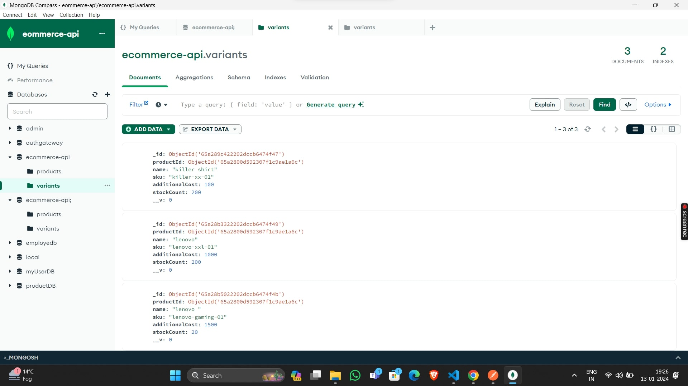
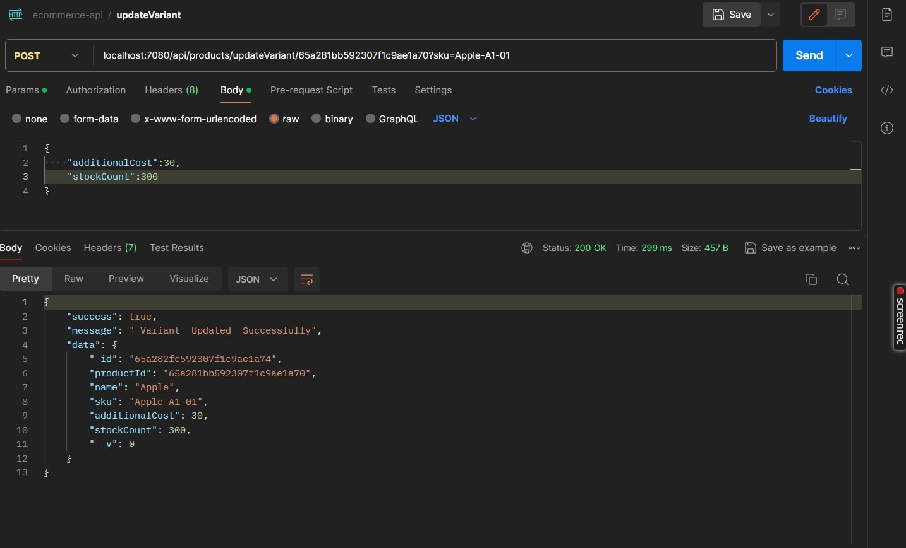

# Ecommerce-APIs

### Description

- CRUD operation on a Variants
- CRUD operations on an Products 
  

## API Reference

#### URL = http://localhost:7080

#### Create Product

```http
  POST /api/products/addProduct
```

| Body (application/json)        | Type     | Description   |
| :----------------------        | :------- | :------------ |
| `name`                         | `string` | **Required**. |
| `description`                  | `string` | **Required**. |
| `price`                        | `number` | **Required**. |


#### Create Variant

```http
  POST /api/products/addVariant/:productId
```

| Body (application/json) | params      | Type       | Description   |
| :---------------------- | :--------   | :--------- | :------------ |
| `-`                     | `productId` | `ObjectId` | **Required**. |
| `name`                  | `-`         | `string`   | **Required**. |
| `sku`                   | `-`         | `string`   | **Requiredc&& Unique**. |
| `additionalCost`        | `-`         | `number`    | **Default**. |
| `stockCount`            | `-`         | `number`    | **Default**. |

#### Update Product

```http
  POST /api/products/updateProduct/:productId
```

| Body (application/json) | params      | Type       | Description   |
| :---------------------- | :--------   | :--------- | :------------ |
| `-`                     | `productId` | `ObjectId` | **Required**. |
| `name`                  | `-`         | `string`   | **Required**. |
| `description`           | `-`         | `string`   | **Requiredc&& Unique**. |
| `price`                 | `-`         | `number`    | **Required**. |

#### Update Variant

```http
  POST /api/products/updateVariant/:productId
```

| Body (application/json) | params      | Type       | Description   |
| :---------------------- | :--------   | :--------- | :------------ |
| `-`                     | `productId` | `ObjectId` | **Required**. |
| `name`                  | `-`         | `string`   | **Required**. |
| `sku`                   | `query`     | `string`   | **Required**. |
| `additionalCost`        | `-`         | `number`    | **Default**. |
| `stockCount`            | `-`         | `number`    | **Default**. |

#### Delete an Product with thier by product Id 

```http
  DELETE /api/products/deleteProduct/:productId
```

| Parameter | Type       | Description   |
| :-------- | :--------- | :------------ |
| `productId` | `ObjectId` | **Required**. |

#### Delete an Variant by query params

```http
  DELETE /api/products/deleteVariant
```

| Parameter | Type       | Description   |
| :-------- | :--------- | :------------ |
| `sku`     | `query`    | **Required**. |

#### Get an Product with their variants by product Id

```http
  GET   /api/products/getProduct/:productId
```

| Parameter | Type       | Description   |
| :-------- | :--------- | :------------ |
| `productId` | `ObjectId` | **Required**. |

#### Searching products by product name, description, or variant name by passing query params

```http
  GET   /api/products/searchProduct
```

| Parameter | Type       | Description   |
| :-------- | :--------- | :------------ |
| `query`   | `string` | **Required**. |


## Environment Variables

To run this project locally, you will need to add the following environment variables to your .env file created in root directory of your project

- PORT
- DB_URL
- DB_URL_TEST

#### Note: Also, you will need to update   localhost:${port_number}

## Screenshots
### Mongo DB record for an Products


 
### Mongo DB record for an Variants



### Add the product 
#### URL = "http://localhost:7080/api/products/addProduct"


### Add the Variant
#### URL = "http://localhost:7080/api/products/addVariant/65a2800d592307f1c9ae1a6c"


### Update The Product 
#### URL = "http://localhost:7080/api/products/updateProduct/65a281bb592307f1c9ae1a70"


### Update The Variant 
#### URL = "http://localhost:7080/api/products/updateVariant/65a281bb592307f1c9ae1a70?sku=Apple-A1-01"

### Delete The Product 
#### URL = "http://localhost:7080/api/products/deleteProduct/65a281bb592307f1c9ae1a70"


### Delete The Variant 
#### URL = "http://localhost:7080/api/products/deleteVariant?query=killer-xl-01"


### Filter The Project Passing The Name, Description And Variant Name
#### URL = http://localhost:7080/api/products/searchProduct?query=lenovo


### Get Product With Variant 
#### URL = http://localhost:7080/api/products/getProduct/65a2800d592307f1c9ae1a6c


